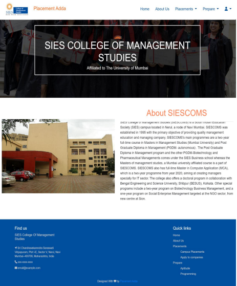

# PlacementAdda

A Placement Management System, which allows placement cell to add companies which are hiring and allows students to apply to those companies. The Placement Cell can manage and view which students are not placed and which are placed already. Students can also view all Frequently Asked Questions during interview rounds and tests.Developed in Node.js, Express.js, MongoDB, RESTful API and HTML, CSS, Bootstrap and EJS (Template Engine).

## Technologies used in the project

a. Node.js
b. Express.js
c. MongoDB
d. RESTful API
e. JavaScript
f. Bootstrap
g. HTML
h. CSS
i. Visual Studio Code

## MODEL:

* Waterfall model.

## Scope of Project

* To make the existing system more efficient.
* To provide one portal to placement cell in order to reduce manual work.
* To provide an easy-to-use interface for students and placement cell alike.

## Future Scope

* As the system is scalable, more modules can be added when required.
* Students can directly be notified via E-mail or phone number regarding opportunities in the campus placements as soon as they arrive.
* In future, Students can get a resume generated in a pdf format which is standard by the Placement Cell.

## Authors

- [Pradeepraj Nadar](https://github.com/Pradeepraj21/)
- [Nitish Nagar](https://github.com/nitish-nagar/)
